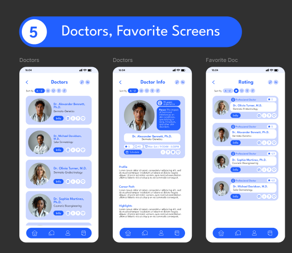
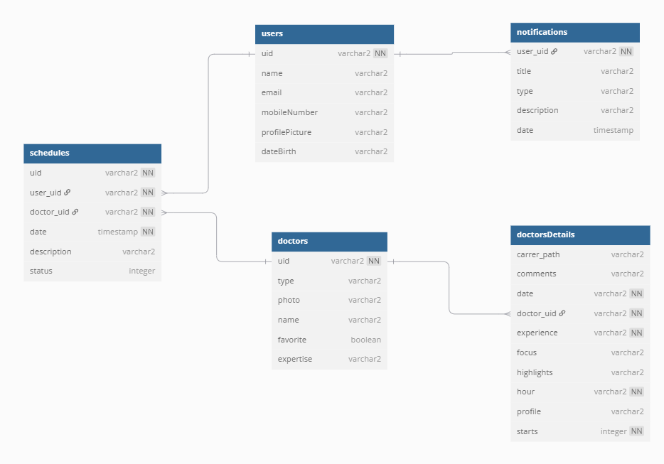

[Leia esta página em português](./README.md)

# Dermatology App

---

## 📋 Summary

- [Dermatology App](#dermatology-app)
  - [📋 Summary](#-summary)
  - [📱 About the Project](#-about-the-project)
  - [🖼 Prototype](#-prototype)
  - [🚀 Features](#-features)
  - [🛠 Technologies Used](#-technologies-used)
  - [🗃 Database Modeling](#-database-modeling)
  - [👤 Credits](#-credits)

---

## 📱 About the Project

The **Dermatology App** is a native Android application developed in **Kotlin**, aimed at dermatology clinics. It is designed to offer a modern and intuitive experience for patients, allowing them to:

- View available doctors
- Check appointments
- Access medical history
- Rate the services provided

Additionally, the app uses **Skeleton Loading** to enhance the user experience during data loading.

---

## 🖼 Prototype

The design is based on the [Template Castle project on Figma](https://www.figma.com/@templatecastle).

  

🔗 [View the full prototype on Figma](https://www.figma.com/design/LUtWhPWvqktkQyL72fonjX/Medical-Health-Mobile-App-Dermatology-App-Ui-Kit-Doctor-Mobile-App-%28Community%29?node-id=0-1&t=tj6L1xRXixSHWKi1-1)

---

## 🚀 Features

- [x] Authentication with email and password
- [x] New user registration
- [x] Login with Google
- [x] Profile data update

---

## 🛠 Technologies Used

- **Kotlin**
- **Android Studio**
- **Firebase Authentication**
- **Cloud Firestore**
- **GitHub Actions**
- **Detekt**
- **Figma** (for UI/UX design)

---

## 🗃 Database Modeling

  

🔗 [View the model on dbdiagram.io](https://dbdiagram.io/d/Dermatology-app-685b44a4f413ba3508b6706d)

---

## 👤 Credits

Developed by me ([@I-Lima](https://github.com/I-Lima)).

Design based on the work of [Template Castle on Figma](https://www.figma.com/@templatecastle) and adapted by me ([@I-Lima](https://github.com/I-Lima)).
