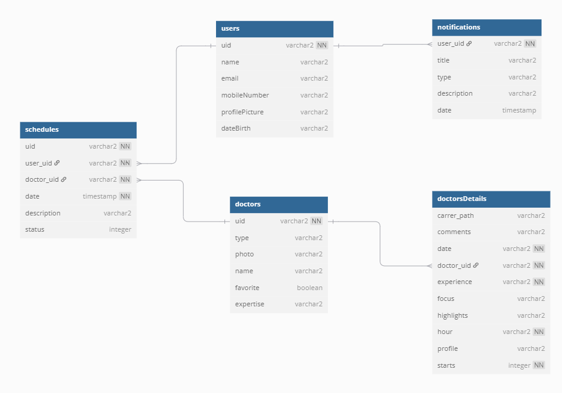

# Dermatology App (Em desenvolvimento)

---

## 📋 Sumário

- [Dermatology App (Em desenvolvimento)](#dermatology-app-em-desenvolvimento)
  - [📋 Sumário](#-sumário)
  - [📱 Sobre o Projeto](#-sobre-o-projeto)
  - [🖼 Protótipo](#-protótipo)
  - [🚀 Funcionalidades](#-funcionalidades)
  - [🛠 Tecnologias Utilizadas](#-tecnologias-utilizadas)
  - [🗃 Modelagem do Banco de Dados](#-modelagem-do-banco-de-dados)
  - [👤 Créditos](#-créditos)

---

## 📱 Sobre o Projeto

O **Dermatology App** é um aplicativo Android nativo desenvolvido em **Kotlin**, voltado para clínicas de dermatologia. Ele visa oferecer uma experiência moderna e intuitiva para pacientes, permitindo:

- Visualização de médicos disponíveis
- Consulta de agendamentos
- Acesso ao histórico de atendimentos
- Avaliação dos serviços prestados

Além disso, o app utiliza o **Skeleton Loading** para suavizar a experiência durante o carregamento de dados.

---

## 🖼 Protótipo

O design foi baseado no projeto [Template Castle no Figma](https://www.figma.com/@templatecastle).

  

🔗 [Acesse o protótipo completo no Figma](https://www.figma.com/design/LUtWhPWvqktkQyL72fonjX/Medical-Health-Mobile-App-Dermatology-App-Ui-Kit-Doctor-Mobile-App-(Community)?node-id=0-1&t=tj6L1xRXixSHWKi1-1)

---

## 🚀 Funcionalidades

- [x] Autenticação com e-mail e senha
- [x] Cadastro de novos usuários
- [x] Login via Google
- [x] Atualização de dados do perfil

---

## 🛠 Tecnologias Utilizadas

- **Kotlin**
- **Android Studio**
- **Firebase Authentication**
- **Cloud Firestore**
- **Github Actions**
- **Detekt**
- **Figma** (para design UI/UX)

---

## 🗃 Modelagem do Banco de Dados

  

🔗 [Visualizar modelo no dbdiagram.io](https://dbdiagram.io/d/Dermatology-app-685b44a4f413ba3508b6706d)

---

## 👤 Créditos

Desenvolvido por mim ([@I-Lima](https://github.com/I-Lima)).

Design baseado no trabalho de [Template Castle no Figma](https://www.figma.com/@templatecastle) e adaptado por mim ([@I-Lima](https://github.com/I-Lima)).
