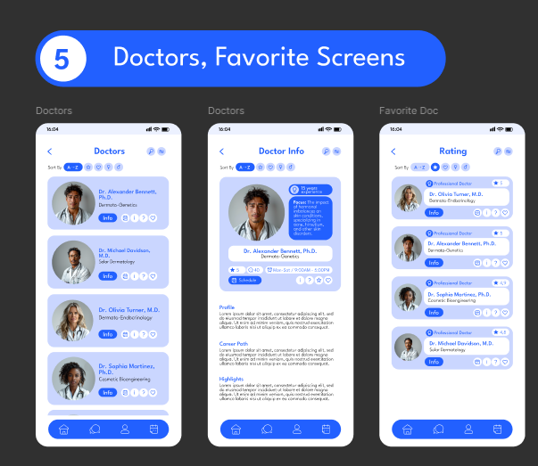

# Dermatology App (Em desenvolvimento)

 

## Sumário

- [Dermatology App (Em desenvolvimento)](#dermatology-app-em-desenvolvimento)
  - [Sumário](#sumário)
  - [Introdução](#introdução)
  - [Protótipo](#protótipo)
  - [Funcionalidades](#funcionalidades)
  - [Tecnologias Utilizadas](#tecnologias-utilizadas)
  - [Créditos](#créditos)
  
   

## Introdução

Um projeto desenvolvido em Kotlin para uma aplicação nativa Android que representa um aplicativo para uma clínica de dermatologia, proporcionando aos pacientes diversas funcionalidades práticas, tais como:

 1. Visualizar a lista de médicos disponíveis para atendimentos;
 2. Consultar os agendamentos de consultas;
 3. Acessar o histórico completo de atendimentos realizados;
 4. Adicionar avaliações sobre o atendimento recebido.

 

## Protótipo

O projeto foi desenvolvido com base no design do [Template Castle](https://www.figma.com/@templatecastle)

 

[Link do protótipo](https://www.figma.com/design/LUtWhPWvqktkQyL72fonjX/Medical-Health-Mobile-App-Dermatology-App-Ui-Kit-Doctor-Mobile-App-(Community)?node-id=0-1&t=tj6L1xRXixSHWKi1-1)

 

## Funcionalidades

- Login
- Criar conta
- Login com Google
- Atualizar dados do usuário

 

## Tecnologias Utilizadas

- Kotlin
- Android Studio
- Firebase Authentication
- Firestore
- Figma
- Github Actions
- Detekt

 

## Créditos

O aplicativo foi desenvolvido por mim e o design foi baseado no projeto do [Template Castle](https://www.figma.com/@templatecastle).
